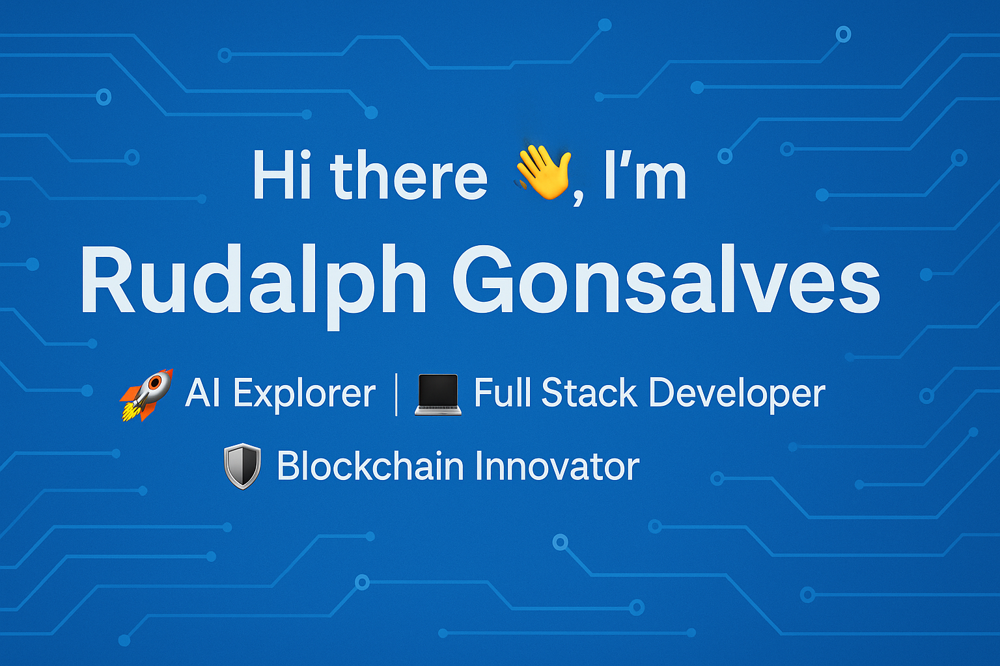

  

<h1 align="center">Hi there 👋, I'm Rudalph Gonsalves</h1>
<h3 align="center"> 🤖 AI Engineer | 💻 Full Stack Developer | ⛓️ Blockchain Enthusiast</h3>

  

---

## 💫 About Me

🧑‍🎓 **M.Sc in Computing (Artificial Intelligence)** — Dublin City University  
🧑‍💻 **B. Tech in Computer Engineering (Honours in Data Science)** — University of Mumbai (Fr. CRCE)   

A software engineer passionate about **AI, Full Stack Development, and Blockchain**, with hands-on experience in building **secure, scalable, and cloud-native systems** using modern tech stacks. Lover of problem-solving and hackathons.  

---

### 💼 Professional Experience

| Role | Company | Duration |
|------|---------|---------|
| Blockchain Developer | Future Logic Systems | 6 Months |
| Automation Engineer | Arcon Techsolutions | 4 Months |
| Software Developer | VPN Digital Services | 6 Months |
| Software Developer | Fire & Security Association of India | 3 Months |

---

### 🏆Hackathons/Ideathons and Awards

1️⃣ **Smart India Hackathon 2023**  
2️⃣ **Sunhacks International Hackathon 2024**  
3️⃣ **Idea, Design & Entrepreneur (IDE) Bootcamp 2024**  
4️⃣ **Prakalp 2024**  
5️⃣ **Avishkar 2024**  
6️⃣ **Best Innovation Solution Award from IIC-FrCRCE 2025**  

---

### 🧑‍⚖️ Judging and Mentorships

- Judge  — **Smart India Hackathon 2025 (Internal Round)**  
- Mentor — **Bit N Build International Hackathon 2025**  
- Mentor — **Bit N Build International Hackathon 2024**  

---

### 🎤 Speaker and Guest Lectures

🔶 Speaker — National Level Faculty Development Program (**RAG, MCP, A2A**)  
🔶 Guest Lecturer — Blockchain (**Hardhat**)  
🔶 Guest Lecturer — How to ace **hackathons**  
🔶 Guest Lecturer — Retrieval Augmented Generation **RAG** (2x)  

---

### 💡 Start Up Journey

📍 **MediSense** — Enlightening Health, Empowering Lives.  
Received **pre incubation** support form **University of Mumbai** for startup idea MediSense.

---

### 🔍 Publications

MediSense: An Advanced Health Tech Application Using Generative AI
Institute of Electrical and Electronics Engineers (IEEE)

• Rudalph Gonsalves et al., 2024 International Conference on Artificial Intelligence and Quantum Computation
Based Sensor Application (ICAIQSA), IEEE.

---

<!-- ### 🏅 Timeline & Achievements

| Year | Award / Certification |
|------|------------------------|
| 🥇 2024 | Sunhacks International Hackathon – **Global Champion** |
| 🥇 2023 | SIH (Smart India Hackathon) – **National Winner** |
| 🥇 2023 | Innovation Design & Entrepreneur (IDE) Bootcamp – **National Winner** |

---
-->

### 🌐 Connect with Me

  
  
  
  

---

## ⚙️ Tech Stack & Expertise

### 🖥 Programming Languages

  
  
  
  
  

### ⚛️ Frameworks & Libraries

  
  
  
  
  
  

### 🤖 AI & Machine Learning

  
  
  
  
  
  
  

### 🗄 Databases (SQL & NoSQL)

  
  
  

### ☁️ Cloud & DevOps

  
  
  
  

### 💻 Software Development

  
  
  

### 🧪 Testing & QA

  
  

### ⚙️ Tools & Practices

  
  
  
  
  

### 📊 Data Structures & Algorithms

  
  
     
  <b>Completed 250+ LeetCode & 50+ CodeChef problems</b>

---

### 🧩 Featured Projects

- 🔬 [**MediSense**](https://medi-sense.vercel.app): AI-powered health tech solution – Published in IEEE | International Hackathon Winner | Best Innovation Solution Award 
- 📑 **Legal Connect**: LLM-powered legal doc assistant – SIH 2023 National Champion | IDE Bootcamp Winner
- 🐾 **JivSankalp**: ML-based species monitoring with image + sound classification  
- 🔗 [**CoolLabs**](https://coolabs.vercel.app/): A Full-Stack Web Application for Team Collaboration | Developed for my own startup
- 🏦 [**ZenithAI**](https://zenith-ai-bob.vercel.app/): Elevating banking excellence with peak performance and passionate service.
- 🏢 [**Creative Techscapes**](https://creative-techscapes.vercel.app/): Design Your Vision Empowered By Our Tech Expertise.
- 🤖 [**RAG**](https://frcrce-rag.vercel.app/): Retrieval-augmented generation
- 💵 [**Secure Pay**](https://secure-payments.vercel.app/): Securing Global Payments with Blockchain Transparency — Ongoing
- ⛓️ [**Fraud Mesh**](https://fraudmesh.vercel.app/): Real-Time AI-Powered Fraud Detection & Prevention Network — Ongoing
---

### 📊 GitHub Stats & Activity

  
  

  

---

### 🏆 GitHub Trophies

---

  

